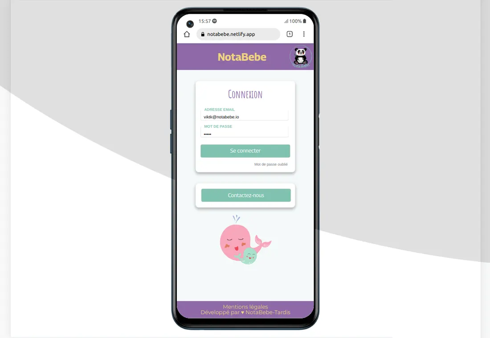

# Notabebe - Carnet de liaison numérique

## Réalisation 

Application d\'échange d\'information entre les parents et le personnel d\'une crèche.
Projet codé avec la bilbliothèque React avec Redux, le préprocesseur SASS, mise en application du jetons JWT et PostgreSql pour la gestion de la base de données.



## Membre de l\'équipe

- [@MorganeBENUREAU](https://github.com/MorganeBENUREAU)
- [@blandinejar](https://github.com/blandinejar)
- [@webtoufik](https://github.com/webtoufik)
- [@RosaHuisman](https://github.com/RosaHuisman)
- [@viktk](https://github.com/viktk)

## Développement

Vous souhaitez exécuter une démo local

- Récupérez le projet suivant :
```bash
git clone https://github.com/viktk/notabebe-viktk
npm install
npm start
url : http://localhost:8080
```